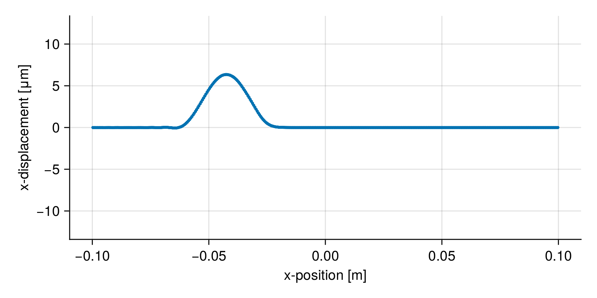

# Julia code wave propagation simulation
```
Fracture as an Emergent Phenomenon
Oberwolfach, 2024

talk:
Peridynamic modeling of the interplay of wave propagation and dynamic fracture
```

## Installation

To install `Peridynamics.jl`, follow these steps:

1. Install Julia from the [official Julia website](https://julialang.org/) if you haven't already.
   We recommend using [`juliaup`](https://github.com/JuliaLang/juliaup). Install using the following commands:\
   **Windows:**\
   Install from the Windows Store (https://www.microsoft.com/store/apps/9NJNWW8PVKMN) or via the following command:
   ```
   winget install julia -s msstore
   ```
   **MacOS & Linux:**
   ```
   curl -fsSL https://install.julialang.org | sh
   ```

2. Launch Julia and open the Julia REPL.

3. Enter the package manager by pressing `]` in the REPL.

4. In the package manager, type:
   ```
   add Peridynamics
   ```

5. Press `Backspace` or `Ctrl + C` to exit the package manager.

## Only simulation - `xwave.jl`
If you just want to run the simulation (code seen in the talk) and look at the results via ParaView (https://www.paraview.org), then run the script `xwave.jl` in the repository.
If you need help using ParaView, take a look at https://kaipartmann.github.io/Peridynamics.jl/stable/howto_visualization/.

## Simulation & post processing with Julia - `xwave_with_postproc.jl`
The script `xwave_with_postproc.jl` contains a function to run the simulation and also all code used to generate images of the wave and a video.

